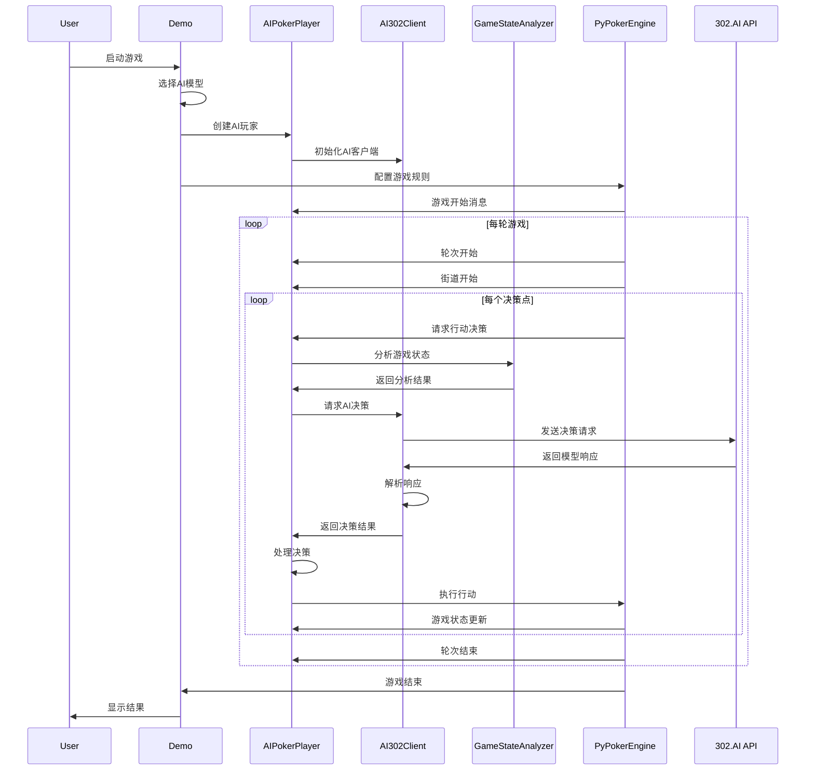

# AI德州扑克大模型对战系统 - 开发文档

## 📋 目录

- [项目概述](#项目概述)
- [系统架构](#系统架构)
- [技术栈与依赖](#技术栈与依赖)
- [核心组件详解](#核心组件详解)
- [API接口设计](#api接口设计)
- [数据流程](#数据流程)
- [配置管理](#配置管理)
- [日志系统](#日志系统)
- [错误处理](#错误处理)
- [性能优化](#性能优化)
- [扩展开发](#扩展开发)
- [部署指南](#部署指南)

## 项目概述

### 🎯 项目目标
基于PyPokerEngine和302.AI平台，开发一个支持多个大模型同时对战的德州扑克AI系统，用于研究不同AI模型在复杂决策场景下的表现差异。

### 🏗️ 设计理念
- **模块化设计**: 各组件职责清晰，便于维护和扩展
- **可配置性**: 支持灵活的模型配置和游戏参数调整
- **可观测性**: 提供详细的日志和调试信息
- **容错性**: 具备完善的错误处理和备用策略
- **可扩展性**: 易于添加新的AI模型和游戏规则

### 📊 技术指标
- **支持模型数量**: 8种主流大模型
- **并发玩家数**: 2-10个AI玩家（最多支持10人桌满桌对战）
- **响应时间**: 平均5-30秒/决策（取决于模型）
- **成本估算**: 10轮游戏约消耗1.5 PTC（约1.5美元）
- **稳定性**: 支持长时间运行，具备自动恢复机制

## 系统架构

### 🏛️ 整体架构图

```
┌─────────────────────────────────────────────────────────────┐
│                    AI德州扑克对战系统                          │
├─────────────────────────────────────────────────────────────┤
│  用户界面层 (Presentation Layer)                             │
│  ┌─────────────┐  ┌─────────────┐  ┌─────────────┐          │
│  │   demo.py   │  │quick_start.py│  │   测试脚本   │          │
│  └─────────────┘  └─────────────┘  └─────────────┘          │
├─────────────────────────────────────────────────────────────┤
│  业务逻辑层 (Business Logic Layer)                           │
│  ┌─────────────────────────────────────────────────────────┐ │
│  │              AIPokerPlayer                              │ │
│  │  ┌─────────────┐  ┌─────────────┐  ┌─────────────┐    │ │
│  │  │  决策引擎   │  │  状态管理   │  │  历史记录   │    │ │
│  │  └─────────────┘  └─────────────┘  └─────────────┘    │ │
│  └─────────────────────────────────────────────────────────┘ │
├─────────────────────────────────────────────────────────────┤
│  服务层 (Service Layer)                                     │
│  ┌─────────────────┐  ┌─────────────────────────────────────┐│
│  │   AI302Client   │  │      GameStateAnalyzer              ││
│  │                 │  │                                     ││
│  │ ┌─────────────┐ │  │ ┌─────────────┐ ┌─────────────────┐││
│  │ │ API调用管理 │ │  │ │ 状态解析器  │ │   策略分析器    │││
│  │ └─────────────┘ │  │ └─────────────┘ └─────────────────┘││
│  │ ┌─────────────┐ │  │ ┌─────────────┐ ┌─────────────────┐││
│  │ │ 响应解析器  │ │  │ │ 信息提取器  │ │   模式识别器    │││
│  │ └─────────────┘ │  │ └─────────────┘ └─────────────────┘││
│  └─────────────────┘  └─────────────────────────────────────┘│
├─────────────────────────────────────────────────────────────┤
│  数据访问层 (Data Access Layer)                              │
│  ┌─────────────┐  ┌─────────────┐  ┌─────────────┐          │
│  │ 配置管理器  │  │ 日志系统    │  │ 缓存管理    │          │
│  └─────────────┘  └─────────────┘  └─────────────┘          │
├─────────────────────────────────────────────────────────────┤
│  外部接口层 (External Interface Layer)                       │
│  ┌─────────────┐  ┌─────────────────────────────────────────┐│
│  │ PyPokerEngine│  │            302.AI API                   ││
│  │             │  │  ┌─────────┐ ┌─────────┐ ┌─────────┐   ││
│  │ ┌─────────┐ │  │  │ Claude  │ │ Gemini  │ │   GPT   │   ││
│  │ │游戏引擎 │ │  │  └─────────┘ └─────────┘ └─────────┘   ││
│  │ └─────────┘ │  │  ┌─────────┐ ┌─────────┐ ┌─────────┐   ││
│  │ ┌─────────┐ │  │  │  Grok   │ │DeepSeek │ │  Qwen   │   ││
│  │ │规则引擎 │ │  │  └─────────┘ └─────────┘ └─────────┘   ││
│  │ └─────────┘ │  │  ┌─────────┐ ┌─────────┐               ││
│  └─────────────┘  │  │   GLM   │ │  Kimi   │               ││
│                    │  └─────────┘ └─────────┘               ││
│                    └─────────────────────────────────────────┘│
└─────────────────────────────────────────────────────────────┘
```

### 🔄 数据流向

```
用户输入 → 游戏配置 → PyPokerEngine → AIPokerPlayer → GameStateAnalyzer
    ↓                                                              ↓
游戏结果 ← 决策执行 ← 决策处理 ← AI302Client ← 状态分析 ← 信息提取
    ↓                           ↓
日志输出                    302.AI API
    ↓                           ↓
统计分析                    大模型响应
```

## 技术栈与依赖

### 🛠️ 核心技术栈

| 技术组件 | 版本 | 用途 | 说明 |
|---------|------|------|------|
| Python | 3.8+ | 主要开发语言 | 支持类型提示和现代语法 |
| PyPokerEngine | 1.0.1 | 扑克游戏引擎 | 提供完整的德州扑克游戏逻辑 |
| requests | 2.31.0 | HTTP客户端 | 用于调用302.AI API |
| python-dotenv | 1.0.0 | 环境变量管理 | 安全的配置管理 |
| colorama | 0.4.6 | 终端颜色输出 | 增强用户界面体验 |

### 📦 依赖关系图

```
ai_texas_holdem/
├── PyPokerEngine (游戏引擎)
│   ├── 游戏规则实现
│   ├── 玩家接口定义
│   └── 状态管理
├── requests (HTTP客户端)
│   ├── API请求发送
│   ├── 响应处理
│   └── 错误处理
├── python-dotenv (配置管理)
│   ├── 环境变量加载
│   └── 配置安全性
└── colorama (界面美化)
    ├── 终端颜色支持
    └── 跨平台兼容
```

### 🔧 开发工具链

```bash
# 开发环境设置
pip install -r requirements.txt

# 代码质量检查
pip install flake8 black mypy

# 测试框架
pip install pytest pytest-cov

# 文档生成
pip install sphinx sphinx-rtd-theme
```

## 核心组件详解

### 🎮 AIPokerPlayer (AI扑克玩家)

**职责**: 实现基于大模型的扑克AI玩家逻辑

**核心方法**:

```python
class AIPokerPlayer(BasePokerPlayer):
    def __init__(self, name: str, model_type: str, debug: bool = True)
    def declare_action(self, valid_actions, hole_card, round_state) -> tuple
    def _process_ai_decision(self, decision, valid_actions) -> tuple
    def _fallback_strategy(self, valid_actions, hole_card, round_state) -> tuple
```

**设计模式**: 策略模式 + 模板方法模式

**关键特性**:
- 继承PyPokerEngine的BasePokerPlayer
- 支持多种AI模型切换
- 具备完善的错误处理和备用策略
- 提供详细的调试信息输出
- 记录完整的决策历史

**状态管理**:
```python
# 玩家状态
self.name: str              # 玩家名称
self.model_type: str        # 使用的AI模型类型
self.debug: bool           # 调试模式开关
self.ai_client: AI302Client # AI客户端实例
self.game_history: List    # 游戏历史记录
self.player_uuid: str      # 玩家唯一标识
```

### 🤖 AI302Client (AI客户端)

**职责**: 封装302.AI API调用逻辑，提供统一的AI模型接口

**核心方法**:
```python
class AI302Client:
    def __init__(self, model_type: str = "claude")
    def chat_completion(self, messages: list, **kwargs) -> Optional[str]
    def get_poker_decision(self, game_state: Dict, debug: bool = False) -> Optional[Dict]
    def _build_poker_prompt(self, game_state: Dict) -> str
    def _parse_text_decision(self, text: str) -> Optional[Dict]
```

**设计模式**: 适配器模式 + 工厂模式

**关键特性**:
- 支持8种不同的AI模型
- 统一的API调用接口
- 智能的响应解析机制
- 完善的错误处理和重试逻辑
- 详细的调试信息输出

**API调用流程**:
```
1. 构建游戏状态prompt
2. 发送HTTP请求到302.AI
3. 接收并解析模型响应
4. 转换为标准决策格式
5. 验证决策有效性
6. 返回最终决策结果
```

### 📊 GameStateAnalyzer (游戏状态分析器)

**职责**: 解析PyPokerEngine的游戏状态，提取AI决策所需的关键信息

**核心方法**:
```python
class GameStateAnalyzer:
    @staticmethod
    def extract_game_info(round_state, hole_card, valid_actions, player_uuid) -> Dict
    @staticmethod
    def _format_cards(cards: List) -> str
    @staticmethod
    def _analyze_opponents_actions(opponents, action_histories, current_street) -> List
    @staticmethod
    def get_hand_strength_description(hole_cards, community_cards) -> str
```

**设计模式**: 静态工厂模式 + 策略模式

**关键特性**:
- 静态方法设计，无状态操作
- 智能的卡牌格式化显示
- 对手行动模式分析
- 手牌强度评估
- 底池赔率计算

**信息提取流程**:
```
PyPokerEngine状态 → 信息提取 → 格式化处理 → AI可理解格式
    ↓                ↓           ↓            ↓
round_state     → 基础信息   → 卡牌显示    → game_info
hole_card       → 手牌分析   → 强度评估    → 决策依据
valid_actions   → 行动选项   → 约束检查    → 有效决策
opponents       → 对手分析   → 模式识别    → 策略调整
```

### ⚙️ 配置管理系统

**文件**: `config.py`

**职责**: 管理系统配置，包括API密钥、模型参数、游戏设置等

**配置结构**:
```python
# API配置
API_BASE_URL: str = "https://api.302.ai/v1"
API_KEY: str = os.getenv("API_302_KEY", "")

# 模型配置
SUPPORTED_MODELS: Dict[str, Dict] = {
    "claude": {
        "model_name": "claude-sonnet-4-5-20250929",
        "max_tokens": 200000,
        "temperature": 0.7
    },
    # ... 其他模型配置
}

# 游戏配置
GAME_CONFIG: Dict[str, int] = {
    "max_round": 10,
    "initial_stack": 1000,
    "small_blind_amount": 10,
    "big_blind_amount": 20
}
```

**配置管理特性**:
- 环境变量安全管理
- 多模型参数配置
- 游戏规则可配置
- 开发/生产环境分离

## API接口设计

### 🔌 302.AI API接口规范

**基础配置**:
```python
BASE_URL = "https://api.302.ai/v1"
HEADERS = {
    "Authorization": f"Bearer {API_KEY}",
    "Content-Type": "application/json"
}
```

**请求格式**:
```json
{
    "model": "claude-sonnet-4-5-20250929",
    "messages": [
        {
            "role": "system",
            "content": "你是一个专业的德州扑克AI玩家..."
        },
        {
            "role": "user", 
            "content": "当前德州扑克游戏状态：..."
        }
    ],
    "max_tokens": 200000,
    "temperature": 0.7
}
```

**响应格式**:
```json
{
    "choices": [
        {
            "message": {
                "content": "{\"action\": \"raise\", \"amount\": 120}"
            }
        }
    ]
}
```

**错误处理**:
```python
# HTTP状态码处理
200: 成功响应
400: 请求参数错误
401: API密钥无效
429: 请求频率限制
500: 服务器内部错误

# 业务逻辑错误
- JSON解析失败
- 决策格式无效
- 模型响应超时
- 网络连接异常
```

### 🎯 决策接口规范

**输入格式** (game_state):
```python
{
    "hole_cards": "A♠ K♥",           # 手牌
    "community_cards": "J♣ 9♠ 2♥",  # 公共牌
    "street": "flop",                # 当前轮次
    "my_stack": 940,                 # 我的筹码
    "pot_size": 120,                 # 底池大小
    "call_amount": 50,               # 跟注金额
    "opponents": [...],              # 对手信息
    "valid_actions": [...]           # 可选行动
}
```

**输出格式** (decision):
```python
{
    "action": "raise",  # 行动类型: fold/call/raise
    "amount": 120       # 行动金额
}
```

## 数据流程

### 🔄 完整游戏流程



### 📈 决策流程详解

```
1. 接收游戏状态
   ├── round_state (轮次状态)
   ├── hole_card (手牌)
   ├── valid_actions (可选行动)
   └── player_uuid (玩家标识)

2. 状态分析处理
   ├── 提取基础信息 (手牌、公共牌、筹码)
   ├── 计算底池赔率
   ├── 分析对手行为
   └── 评估手牌强度

3. 构建AI提示词
   ├── 系统角色设定
   ├── 游戏状态描述
   ├── 决策考虑因素
   └── 输出格式要求

4. 调用AI模型
   ├── 发送HTTP请求
   ├── 等待模型响应
   ├── 处理网络异常
   └── 解析响应内容

5. 决策结果处理
   ├── JSON格式解析
   ├── 文本内容提取
   ├── 决策有效性验证
   └── 金额范围调整

6. 执行最终行动
   ├── 返回标准格式
   ├── 记录决策历史
   ├── 输出调试信息
   └── 触发游戏引擎
```

## 配置管理

### 🔧 环境配置

**环境变量文件** (`.env`):
```bash
# 302.AI API配置
API_302_KEY=your_302_ai_api_key_here

# 可选配置
API_BASE_URL=https://api.302.ai/v1
DEBUG_MODE=true
LOG_LEVEL=INFO
```

**配置加载机制**:
```python
from dotenv import load_dotenv
import os

# 加载环境变量
load_dotenv()

# 获取配置值
API_KEY = os.getenv("API_302_KEY", "")
DEBUG_MODE = os.getenv("DEBUG_MODE", "true").lower() == "true"
LOG_LEVEL = os.getenv("LOG_LEVEL", "INFO")
```

### 🎮 游戏参数配置

**默认配置**:
```python
GAME_CONFIG = {
    "max_round": 10,        # 最大轮数
    "initial_stack": 1000,  # 初始筹码
    "small_blind_amount": 10, # 小盲注
    "big_blind_amount": 20    # 大盲注 (自动计算)
}
```

**动态配置**:
```python
def setup_game_config(selected_models):
    """根据用户输入动态配置游戏参数"""
    config = GAME_CONFIG.copy()
    
    # 用户自定义配置
    if not use_default_config():
        config['max_round'] = int(input("最大轮数: "))
        config['initial_stack'] = int(input("初始筹码: "))
        config['small_blind_amount'] = int(input("小盲注: "))
    
    return config
```

### 🤖 模型参数配置

**模型配置结构**:
```python
MODEL_CONFIG_SCHEMA = {
    "model_name": str,      # 模型名称
    "max_tokens": int,      # 最大token数
    "temperature": float,   # 温度参数
    "timeout": int,         # 请求超时时间
    "retry_count": int,     # 重试次数
    "fallback_model": str   # 备用模型
}
```

**配置验证**:
```python
def validate_model_config(config: Dict) -> bool:
    """验证模型配置的有效性"""
    required_fields = ["model_name", "max_tokens", "temperature"]
    
    for field in required_fields:
        if field not in config:
            raise ValueError(f"Missing required field: {field}")
    
    if config["max_tokens"] <= 0:
        raise ValueError("max_tokens must be positive")
    
    if not 0 <= config["temperature"] <= 2:
        raise ValueError("temperature must be between 0 and 2")
    
    return True
```

## 日志系统

### 📝 日志架构设计

**日志级别**:
```python
import logging

# 日志级别定义
CRITICAL = 50  # 严重错误，系统无法继续
ERROR = 40     # 错误，但系统可以继续
WARNING = 30   # 警告，可能的问题
INFO = 20      # 一般信息
DEBUG = 10     # 调试信息
```

**日志分类**:
```
📊 游戏日志 (Game Logs)
├── 游戏开始/结束
├── 轮次进度
├── 玩家行动
└── 结果统计

🤖 AI决策日志 (AI Decision Logs)  
├── 状态分析
├── Prompt构建
├── 模型响应
└── 决策处理

🔧 系统日志 (System Logs)
├── API调用
├── 错误处理
├── 性能监控
└── 配置变更

🐛 调试日志 (Debug Logs)
├── 变量状态
├── 执行流程
├── 异常堆栈
└── 性能指标
```

### 🎨 增强日志输出

**调试信息格式**:
```python
def _print_debug_info(self, game_state, messages, prompt):
    """打印详细的调试信息"""
    print(f"\n{'='*80}")
    print(f"🤖 [{self.model_type.upper()}] AI决策调试信息")
    print(f"{'='*80}")
    
    # 游戏状态摘要
    print(f"🎮 游戏状态摘要:")
    print(f"   手牌: {game_state.get('hole_cards', '未知')}")
    print(f"   公共牌: {game_state.get('community_cards', '无')}")
    # ... 更多信息
    
    # 模型配置
    print(f"\n🔧 模型配置:")
    print(f"   模型名称: {self.model_config['model_name']}")
    print(f"   最大tokens: {self.model_config['max_tokens']}")
    
    # 完整Prompt
    print(f"\n📝 发送给模型的完整Prompt:")
    print(f"{'─'*60}")
    print(prompt)
    print(f"{'─'*60}")
```

**性能监控日志**:
```python
import time
from functools import wraps

def log_performance(func):
    """性能监控装饰器"""
    @wraps(func)
    def wrapper(*args, **kwargs):
        start_time = time.time()
        result = func(*args, **kwargs)
        end_time = time.time()
        
        duration = end_time - start_time
        print(f"⏱️  {func.__name__} 执行时间: {duration:.2f}秒")
        
        return result
    return wrapper
```

### 📊 日志分析工具

**决策统计分析**:
```python
def analyze_decision_history(game_history: List[Dict]) -> Dict:
    """分析AI决策历史"""
    stats = {
        'total_decisions': len(game_history),
        'action_distribution': {},
        'average_bet_size': 0,
        'win_rate': 0,
        'aggression_factor': 0
    }
    
    # 统计行动分布
    for record in game_history:
        action = record['final_action']
        stats['action_distribution'][action] = \
            stats['action_distribution'].get(action, 0) + 1
    
    # 计算激进因子
    raises = stats['action_distribution'].get('raise', 0)
    calls = stats['action_distribution'].get('call', 0)
    stats['aggression_factor'] = raises / max(calls, 1)
    
    return stats
```

## 错误处理

### 🛡️ 异常处理策略

**异常分类**:
```python
# 自定义异常类
class PokerAIException(Exception):
    """扑克AI基础异常"""
    pass

class APICallException(PokerAIException):
    """API调用异常"""
    pass

class DecisionParsingException(PokerAIException):
    """决策解析异常"""
    pass

class GameStateException(PokerAIException):
    """游戏状态异常"""
    pass

class ConfigurationException(PokerAIException):
    """配置异常"""
    pass
```

**错误处理流程**:
```python
def declare_action(self, valid_actions, hole_card, round_state):
    """带完整错误处理的决策方法"""
    try:
        # 主要决策逻辑
        return self._make_ai_decision(valid_actions, hole_card, round_state)
        
    except APICallException as e:
        self._log_error(f"API调用失败: {e}")
        return self._fallback_strategy(valid_actions, hole_card, round_state)
        
    except DecisionParsingException as e:
        self._log_error(f"决策解析失败: {e}")
        return self._fallback_strategy(valid_actions, hole_card, round_state)
        
    except Exception as e:
        self._log_error(f"未知异常: {e}")
        return self._emergency_action(valid_actions)
```

**重试机制**:
```python
import time
from functools import wraps

def retry_on_failure(max_retries=3, delay=1.0, backoff=2.0):
    """重试装饰器"""
    def decorator(func):
        @wraps(func)
        def wrapper(*args, **kwargs):
            retries = 0
            current_delay = delay
            
            while retries < max_retries:
                try:
                    return func(*args, **kwargs)
                except Exception as e:
                    retries += 1
                    if retries >= max_retries:
                        raise e
                    
                    print(f"⚠️  第{retries}次重试，{current_delay}秒后重试...")
                    time.sleep(current_delay)
                    current_delay *= backoff
            
            return None
        return wrapper
    return decorator
```

### 🔄 备用策略系统

**策略优先级**:
```
1. AI模型决策 (主策略)
   ├── 成功 → 执行决策
   └── 失败 ↓

2. 规则基础策略 (备用策略)
   ├── 手牌强度评估
   ├── 底池赔率计算
   ├── 筹码管理
   └── 风险控制

3. 保守策略 (紧急策略)
   ├── 强牌 → 跟注
   ├── 中等牌 → 跟注(小额)
   └── 弱牌 → 弃牌

4. 默认行动 (最后保障)
   └── 弃牌 (确保游戏继续)
```

**备用策略实现**:
```python
def _fallback_strategy(self, valid_actions, hole_card, round_state):
    """多层次备用策略"""
    try:
        # 第一层：基于手牌强度的策略
        return self._hand_strength_strategy(valid_actions, hole_card, round_state)
    except Exception:
        try:
            # 第二层：保守策略
            return self._conservative_strategy(valid_actions)
        except Exception:
            # 第三层：默认行动
            return self._default_action(valid_actions)

def _default_action(self, valid_actions):
    """默认行动：确保游戏能够继续"""
    # 优先选择弃牌
    for action in valid_actions:
        if action['action'] == 'fold':
            return 'fold', 0
    
    # 如果不能弃牌，选择第一个可用行动
    if valid_actions:
        first_action = valid_actions[0]
        return first_action['action'], first_action.get('amount', 0)
    
    # 最后的保障
    return 'fold', 0
```

## 性能优化

### ⚡ 响应时间优化

**异步处理**:
```python
import asyncio
import aiohttp

class AsyncAI302Client:
    """异步AI客户端"""
    
    async def async_chat_completion(self, messages, **kwargs):
        """异步API调用"""
        async with aiohttp.ClientSession() as session:
            async with session.post(
                f"{API_BASE_URL}/chat/completions",
                headers=self.headers,
                json=self._build_payload(messages, **kwargs),
                timeout=aiohttp.ClientTimeout(total=30)
            ) as response:
                if response.status == 200:
                    result = await response.json()
                    return result["choices"][0]["message"]["content"]
                return None
```

**缓存机制**:
```python
from functools import lru_cache
import hashlib

class CachedGameStateAnalyzer:
    """带缓存的游戏状态分析器"""
    
    @lru_cache(maxsize=128)
    def _cached_hand_strength(self, hole_cards_str, community_cards_str):
        """缓存手牌强度计算结果"""
        hole_cards = self._parse_cards(hole_cards_str)
        community_cards = self._parse_cards(community_cards_str)
        return self._calculate_hand_strength(hole_cards, community_cards)
    
    def get_hand_strength_description(self, hole_cards, community_cards):
        """使用缓存的手牌强度描述"""
        hole_str = "|".join(hole_cards)
        community_str = "|".join(community_cards)
        return self._cached_hand_strength(hole_str, community_str)
```

**连接池优化**:
```python
import requests
from requests.adapters import HTTPAdapter
from urllib3.util.retry import Retry

class OptimizedAI302Client:
    """优化的AI客户端"""
    
    def __init__(self, model_type):
        self.session = requests.Session()
        
        # 配置重试策略
        retry_strategy = Retry(
            total=3,
            backoff_factor=1,
            status_forcelist=[429, 500, 502, 503, 504],
        )
        
        # 配置HTTP适配器
        adapter = HTTPAdapter(
            max_retries=retry_strategy,
            pool_connections=10,
            pool_maxsize=20
        )
        
        self.session.mount("http://", adapter)
        self.session.mount("https://", adapter)
```

### 💾 内存优化

**对象池模式**:
```python
class AIPlayerPool:
    """AI玩家对象池"""
    
    def __init__(self, max_size=10):
        self._pool = []
        self._max_size = max_size
    
    def get_player(self, name, model_type, debug=True):
        """获取AI玩家实例"""
        if self._pool:
            player = self._pool.pop()
            player.reset(name, model_type, debug)
            return player
        else:
            return AIPokerPlayer(name, model_type, debug)
    
    def return_player(self, player):
        """归还AI玩家实例"""
        if len(self._pool) < self._max_size:
            player.cleanup()
            self._pool.append(player)
```

**内存监控**:
```python
import psutil
import gc

def monitor_memory_usage():
    """监控内存使用情况"""
    process = psutil.Process()
    memory_info = process.memory_info()
    
    print(f"📊 内存使用情况:")
    print(f"   RSS: {memory_info.rss / 1024 / 1024:.2f} MB")
    print(f"   VMS: {memory_info.vms / 1024 / 1024:.2f} MB")
    print(f"   可用内存: {psutil.virtual_memory().available / 1024 / 1024:.2f} MB")
    
    # 强制垃圾回收
    collected = gc.collect()
    print(f"   垃圾回收: {collected} 个对象")
```

## 扩展开发

### 🔌 添加新的AI模型

**步骤1**: 在配置中添加模型
```python
# config.py
SUPPORTED_MODELS["new_model"] = {
    "model_name": "new-model-name",
    "max_tokens": 4096,
    "temperature": 0.7,
    "api_endpoint": "custom_endpoint",  # 可选
    "headers": {"Custom-Header": "value"}  # 可选
}
```

**步骤2**: 扩展客户端支持
```python
# ai_client.py
class AI302Client:
    def _get_api_endpoint(self):
        """获取API端点"""
        return self.model_config.get("api_endpoint", f"{API_BASE_URL}/chat/completions")
    
    def _get_headers(self):
        """获取请求头"""
        headers = self.headers.copy()
        custom_headers = self.model_config.get("headers", {})
        headers.update(custom_headers)
        return headers
```

**步骤3**: 测试新模型
```python
# test/test_new_model.py
def test_new_model():
    """测试新模型集成"""
    client = AI302Client("new_model")
    
    test_game_state = {
        "hole_cards": "A♠ K♥",
        "community_cards": "J♣ 9♠ 2♥",
        # ... 其他测试数据
    }
    
    decision = client.get_poker_decision(test_game_state, debug=True)
    assert decision is not None
    assert "action" in decision
    assert decision["action"] in ["fold", "call", "raise"]
```

### 🎮 扩展游戏规则

**添加新的扑克变体**:
```python
# game_variants.py
class OmahaPokerPlayer(AIPokerPlayer):
    """奥马哈扑克AI玩家"""
    
    def _analyze_omaha_hand(self, hole_cards, community_cards):
        """分析奥马哈手牌（必须使用2张手牌+3张公共牌）"""
        # 奥马哈特殊规则实现
        pass
    
    def _build_omaha_prompt(self, game_state):
        """构建奥马哈扑克的专用prompt"""
        prompt = f"""
        当前奥马哈扑克游戏状态：
        注意：奥马哈扑克必须使用恰好2张手牌和3张公共牌组成最佳牌型
        
        我的手牌: {game_state.get('hole_cards', '未知')} (4张)
        公共牌: {game_state.get('community_cards', [])}
        ...
        """
        return prompt
```

**自定义决策策略**:
```python
# custom_strategies.py
class AggressiveStrategy:
    """激进策略"""
    
    @staticmethod
    def make_decision(game_state, valid_actions):
        """激进的决策逻辑"""
        # 更倾向于加注和跟注
        for action in valid_actions:
            if action['action'] == 'raise':
                return 'raise', action['amount']['min']
        
        for action in valid_actions:
            if action['action'] == 'call':
                return 'call', action['amount']
        
        return 'fold', 0

class ConservativeStrategy:
    """保守策略"""
    
    @staticmethod
    def make_decision(game_state, valid_actions):
        """保守的决策逻辑"""
        # 只在强牌时才加注
        hand_strength = analyze_hand_strength(game_state)
        
        if hand_strength > 0.8:  # 强牌
            for action in valid_actions:
                if action['action'] == 'raise':
                    return 'raise', action['amount']['min']
        
        if hand_strength > 0.5:  # 中等牌
            for action in valid_actions:
                if action['action'] == 'call':
                    return 'call', action['amount']
        
        return 'fold', 0
```

### 📊 数据分析扩展

**游戏数据收集**:
```python
# analytics.py
class GameAnalytics:
    """游戏数据分析"""
    
    def __init__(self):
        self.game_data = []
        self.player_stats = {}
    
    def record_game(self, game_result, players):
        """记录游戏数据"""
        game_record = {
            'timestamp': time.time(),
            'players': [p.name for p in players],
            'final_stacks': {p['name']: p['stack'] for p in game_result['players']},
            'total_rounds': game_result['rule']['max_round'],
            'decisions': self._collect_decisions(players)
        }
        self.game_data.append(game_record)
    
    def analyze_player_performance(self, player_name):
        """分析玩家表现"""
        player_games = [g for g in self.game_data if player_name in g['players']]
        
        stats = {
            'total_games': len(player_games),
            'win_rate': self._calculate_win_rate(player_name, player_games),
            'avg_profit': self._calculate_avg_profit(player_name, player_games),
            'decision_patterns': self._analyze_decision_patterns(player_name, player_games)
        }
        
        return stats
    
    def generate_report(self):
        """生成分析报告"""
        report = {
            'total_games': len(self.game_data),
            'player_rankings': self._rank_players(),
            'model_comparison': self._compare_models(),
            'performance_trends': self._analyze_trends()
        }
        
        return report
```

## 部署指南

### 🚀 本地部署

**环境准备**:
```bash
# 1. 克隆项目
git clone <repository-url>
cd ai_texas_holdem

# 2. 创建虚拟环境
python -m venv venv
source venv/bin/activate  # Linux/Mac
# 或
venv\Scripts\activate     # Windows

# 3. 安装依赖
pip install -r requirements.txt

# 4. 配置环境变量
cp env_example.txt .env
# 编辑.env文件，添加API密钥

# 5. 运行测试
python test/test_basic.py

# 6. 启动演示
python demo.py
```

**目录结构**:
```
ai_texas_holdem/
├── ai_client.py           # AI客户端
├── ai_poker_player.py     # AI玩家
├── config.py              # 配置管理
├── demo.py                # 主演示程序
├── game_state_analyzer.py # 状态分析器
├── quick_start.py         # 快速启动
├── requirements.txt       # 依赖列表
├── env_example.txt        # 环境配置模板
├── .env                   # 环境配置文件 (需创建)
├── doc/                   # 文档目录
│   └── development_guide.md
├── test/                  # 测试目录
│   ├── test_basic.py
│   └── test_models.py
└── logs/                  # 日志目录 (自动创建)
```

### 🐳 Docker部署

**Dockerfile**:
```dockerfile
FROM python:3.9-slim

WORKDIR /app

# 安装系统依赖
RUN apt-get update && apt-get install -y \
    gcc \
    && rm -rf /var/lib/apt/lists/*

# 复制依赖文件
COPY requirements.txt .

# 安装Python依赖
RUN pip install --no-cache-dir -r requirements.txt

# 复制应用代码
COPY . .

# 创建日志目录
RUN mkdir -p logs

# 设置环境变量
ENV PYTHONPATH=/app
ENV PYTHONUNBUFFERED=1

# 暴露端口 (如果需要)
EXPOSE 8000

# 启动命令
CMD ["python", "demo.py"]
```

**docker-compose.yml**:
```yaml
version: '3.8'

services:
  ai-poker:
    build: .
    container_name: ai-texas-holdem
    environment:
      - API_302_KEY=${API_302_KEY}
      - DEBUG_MODE=true
    volumes:
      - ./logs:/app/logs
      - ./.env:/app/.env
    stdin_open: true
    tty: true
    restart: unless-stopped
```

**部署命令**:
```bash
# 构建镜像
docker-compose build

# 启动服务
docker-compose up -d

# 查看日志
docker-compose logs -f

# 进入容器
docker-compose exec ai-poker bash

# 停止服务
docker-compose down
```

### ☁️ 云端部署

**AWS部署示例**:
```bash
# 1. 创建EC2实例
aws ec2 run-instances \
    --image-id ami-0abcdef1234567890 \
    --instance-type t3.medium \
    --key-name my-key-pair \
    --security-group-ids sg-903004f8

# 2. 配置安全组
aws ec2 authorize-security-group-ingress \
    --group-id sg-903004f8 \
    --protocol tcp \
    --port 22 \
    --cidr 0.0.0.0/0

# 3. 连接实例并部署
ssh -i my-key-pair.pem ec2-user@<instance-ip>
git clone <repository-url>
cd ai_texas_holdem
./deploy.sh
```

**部署脚本** (`deploy.sh`):
```bash
#!/bin/bash

# 更新系统
sudo yum update -y

# 安装Python 3.9
sudo yum install -y python39 python39-pip

# 安装项目依赖
pip3.9 install -r requirements.txt

# 配置环境变量
cp env_example.txt .env
echo "请编辑.env文件添加API密钥"

# 创建systemd服务
sudo tee /etc/systemd/system/ai-poker.service > /dev/null <<EOF
[Unit]
Description=AI Texas Holdem Service
After=network.target

[Service]
Type=simple
User=ec2-user
WorkingDirectory=/home/ec2-user/ai_texas_holdem
ExecStart=/usr/bin/python3.9 demo.py
Restart=always
RestartSec=10

[Install]
WantedBy=multi-user.target
EOF

# 启动服务
sudo systemctl daemon-reload
sudo systemctl enable ai-poker
sudo systemctl start ai-poker
```

### 📊 监控和维护

**健康检查**:
```python
# health_check.py
import requests
import time
from config import API_KEY, API_BASE_URL

def check_api_health():
    """检查API服务健康状态"""
    try:
        response = requests.get(
            f"{API_BASE_URL}/models",
            headers={"Authorization": f"Bearer {API_KEY}"},
            timeout=10
        )
        return response.status_code == 200
    except Exception:
        return False

def check_system_resources():
    """检查系统资源"""
    import psutil
    
    cpu_usage = psutil.cpu_percent(interval=1)
    memory_usage = psutil.virtual_memory().percent
    disk_usage = psutil.disk_usage('/').percent
    
    return {
        'cpu': cpu_usage,
        'memory': memory_usage,
        'disk': disk_usage,
        'healthy': cpu_usage < 80 and memory_usage < 80 and disk_usage < 90
    }

if __name__ == "__main__":
    print("🔍 系统健康检查")
    print(f"API状态: {'✅ 正常' if check_api_health() else '❌ 异常'}")
    
    resources = check_system_resources()
    print(f"系统资源: {'✅ 正常' if resources['healthy'] else '⚠️ 警告'}")
    print(f"  CPU: {resources['cpu']:.1f}%")
    print(f"  内存: {resources['memory']:.1f}%")
    print(f"  磁盘: {resources['disk']:.1f}%")
```

**日志轮转配置**:
```bash
# /etc/logrotate.d/ai-poker
/home/ec2-user/ai_texas_holdem/logs/*.log {
    daily
    missingok
    rotate 7
    compress
    delaycompress
    notifempty
    create 644 ec2-user ec2-user
    postrotate
        systemctl reload ai-poker
    endscript
}
```

---

## 📚 总结

本开发文档详细介绍了AI德州扑克大模型对战系统的完整架构、实现细节和部署方案。系统采用模块化设计，具备良好的可扩展性和可维护性，支持多种AI模型的灵活配置和对战。

### 🎯 核心优势

1. **架构清晰**: 分层设计，职责明确
2. **扩展性强**: 易于添加新模型和游戏规则
3. **可观测性**: 详细的日志和调试信息
4. **容错性好**: 完善的错误处理和备用策略
5. **部署灵活**: 支持本地、Docker和云端部署

### 🚀 未来发展

- 支持更多扑克变体（奥马哈、七张牌等）
- 添加实时对战功能
- 集成更多AI模型提供商
- 开发Web界面
- 增加数据分析和可视化功能

通过本文档，开发者可以快速理解系统架构，进行二次开发和功能扩展。
